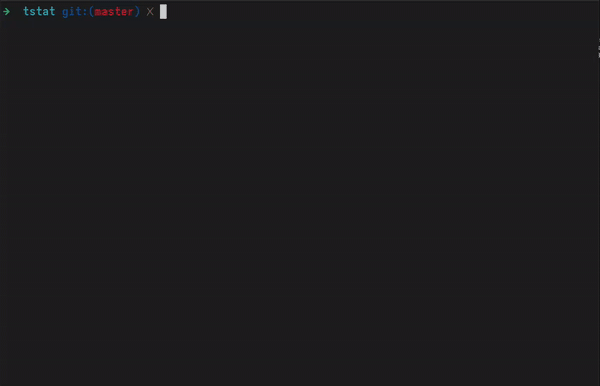

# tstats - Terminal Weather Stats


`tstats` is a simple and elegant command-line tool written in Go that provides you with the current weather for your location, right in your terminal.

It features a clean terminal user interface (TUI) with a progress indicator, and it automatically detects your location to fetch the weather forecast.

<p align="center">
    
</p>

## Features

- Automatic Location Detection: Uses your public IP address to determine your city and fetch the relevant weather forecast.

- Current Weather: Displays the current temperature for your detected location.

- Smart Caching: Caches geolocation and weather data locally to provide instant results and reduce API calls.

- Cache Clearing: A `--clear` flag allows you to force-fetch new data.

- Aesthetic UI: Built with Bubble Tea for a pleasant user experience.

## Installation and Usage
### Prerequisites

- You must have Go (version 1.18 or newer) installed on your system.

- A make utility is required to use the provided Makefile.

**1. Clone the Repository**

First, get the source code by cloning the repository:

```cmd
git clone <your-repository-url>
cd tstats
```

**2. Install the Application**

Use the provided Makefile to build the binary. This will create an executable file at bin/tstats and then copy into `/usr/local/bin`.

```cmd
make install
```

**3. Run the Application**

You can run the application directly after installing it:

```
tstats
```

**Forcing a Cache Refresh**

To improve performance, `tstats` make a cache of user's geolocation and weather when executed. The caches are located in `/tmp` and they're considered invalid after 30 minutes.

To ignore any cached data and fetch fresh information from the APIs, use the `--clear` flag:

```
tstats --clear
```

<p align="center">
    
</p>


## Privacy Note

For your convenience, tstats automatically determines your location by using your public IP address. This process involves two external API calls:

- **api.ipify.org**: To find out your public IP address.

- **ip-api.com:** To translate your IP address into an approximate geographical location (city, country, and coordinates).

This information is used solely for the purpose of fetching weather data for your current location and is not stored or shared for any other reason. The fetched data is cached locally on your machine just to improve performance.

## Acknowledgements

This tool is powered by the following services and libraries:

- APIs:

    - Open-Meteo for weather forecast data.

    - ip-api.com for IP geolocation.

    - ipify.org for public IP lookup.

- Go Libraries:

    - Bubble Tea

    - Lipgloss

## Uninstall

If you want to unsintall `tstats`, just go into the project folder and run the following command:

```cmd
make uninstall
```